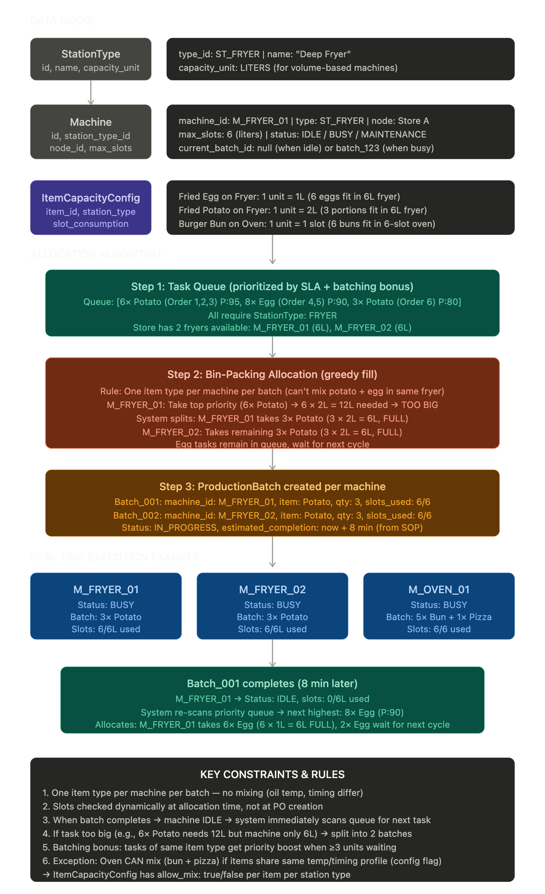

# OneSystem Business Specification
**Version:** 1.2 (Corrected Draft)
**Status:** CONFIRMED – Terminology & Business Logic Corrections Applied

This document summarizes the core business logic and workflows designed for the OneSystem chain management platform.

## 1. Node Hierarchy & Organization

- **Tenant (ORG)**: A chain organization (e.g., "Nobi Fried Chicken").
- **HQ**: Central governance for all financial and operational data. **Owns procurement authority** — HQ is the sole node authorized to raise Purchase Orders to external suppliers.
- **Store**: Point of sale and local production (kitchen). ~~Local procurement~~ → Stores do **not** perform external procurement; they request stock from Factory or other Stores.
- **Factory (Central Kitchen)**: Large-scale production and distribution of semi-products and finished products. Receives raw materials from HQ-issued Purchase Orders. *(v1 supports a single Factory per Tenant. Multi-factory support is deferred to a future phase.)*

### Item Classification

All physical entities in the system are called **Items** (not "products"). Items are sub-classified as:

- **Product** – Finished goods sold to end customers.
- **Semi-Product** – Intermediate goods produced at Factory, used as components in further production (e.g., seasoned beef patty, marinated chicken).
- **Raw Material** – Base ingredients sourced from external suppliers.
- **Asset/Supply** – Non-food items a store needs but does not sell (e.g., POS machines, packaging supplies).

## 2. Supply Chain Workflows

### 2.1 Replenishment Flow (Store → Factory → HQ → Supplier)

*Goal: Managing stock replenishment across nodes via a controlled, top-down procurement chain.*

**Trigger (Primary — Automatic):** When a Store item's stock level reaches or falls below its configured minimum threshold, the system **automatically generates a `SupplyRequest`** targeting the Factory — no staff action required.

**Trigger (Secondary — Manual):** Store staff may also manually create a `SupplyRequest` at any time outside of the threshold trigger (e.g., anticipating demand, correcting an oversight).

1. **Supply Request**: Generated automatically by the system on threshold breach, or optionally created manually by Store staff.
2. **Factory Review**: Factory manager reviews and, using BOM data, determines the raw materials needed to fulfill the request.
3. **Material Request to HQ**: Factory raises a `MaterialRequest` to HQ listing required raw materials.
4. **HQ Purchase Order**: HQ reviews and issues a `PurchaseOrder` to the external supplier.
5. **Supplier Delivery to Factory**: Supplier delivers goods to the Factory.
6. **Goods Receipt (Stock In)**: Factory Stock Keeper confirms receipt and performs a Stock In, **linked to the originating PO**. No unlinked inbound stock is permitted.
7. **Production**: Factory uses received raw materials to produce semi-products/products per the relevant BOM + SOP.
8. **Factory → Store Shipment**: Factory creates a `ShipmentOrder` containing:
   - Driver contact (phone number)
   - Photo evidence of goods before dispatch
   - Shipping fee
   - Upon dispatch confirmation: system executes **Stock Out** at Factory.
9. **Store Receipt**: Store staff confirms arrival → system executes **Stock In** at Store. **No paper-based (ký tay) receipts — all confirmation is digital.**

> **Key rule:** HQ holds exclusive authority to purchase from external suppliers. The Factory requests materials; it does not independently procure.

---

### 2.2 Inter-Store Transfer *(Optional — In Scope)*

*Goal: Allow a Store to borrow or buy stock from another Store when Factory replenishment is too slow.*

1. **Request**: Store A creates a `StoreTransferRequest` targeting Store B for a specific item and quantity.
2. **Review**: Store B manager reviews availability and approves or rejects.
3. **Approval**: Upon approval, a `TransferOrder` is generated.
4. **Dispatch & Receipt**: Stock Out at Store B; Store A confirms receipt → Stock In at Store A.


## 3. Bill of Materials (BOM) & Standard Operating Procedure (SOP)

### 3.1 Bill of Materials (BOM)

A **BOM** defines the components required to produce one unit of an Item (Product or Semi-Product).

- Links a finished/semi item to its required components (semi-products, raw materials) with quantities.
- Defined at **HQ level only.** Factory and Store do not create or modify BOMs.
- Drives production planning, Factory material requests, and stock consumption on production.

### 3.2 Standard Operating Procedure (SOP)

A **SOP** defines the step-by-step production process for a given BOM (sequence, timing, equipment, labor).

- Each BOM has a linked SOP.
- SOPs are used to generate **Production Orders** and estimate throughput capacity.

### 3.3 Production Orders

Generated from BOM + SOP. A Production Order captures:

| Field | Description |
|---|---|
| Target Item | The item being produced (Product or Semi-Product) |
| Target Quantity | How many units to produce (in Base Unit) |
| BOM Snapshot | Components and quantities required, locked at time of order creation |
| SOP Reference | The procedure to follow |
| Scheduled Start / End | Planned production window |
| Assigned Station | Equipment or kitchen station allocated for this run |
| Assigned Staff / Shift | Staff or shift responsible |
| Actual Output Quantity | Recorded on completion — enables yield tracking vs. expected |
| Status | `PENDING` → `IN_PROGRESS` → `COMPLETED` / `CANCELLED` |
| **Total Production Cost** | **Total cost of this execution, calculated and locked at completion** |

---

#### Production Cost Breakdown

The org owner can view the cost breakdown of any completed Production Order. Costs are **snapshotted at execution time** — historical orders preserve their actual cost even if material prices or labor rates change later.

**1. Material Cost**
- Calculated from the actual components consumed (per BOM Snapshot) × their **unit cost at the time of the PO/Goods Receipt** that supplied those materials.
- Reflects real purchase prices, which may vary across different supplier batches.
- Formula: `Σ (Component Quantity Consumed × Unit Cost at Receipt)`

**2. Labor Cost**
- Based on the assigned staff/shift hours × their configured hourly wage rate.
- Formula: `Σ (Staff Hours × Hourly Rate)`

**3. Overhead Cost**
- Covers utilities, packaging, equipment usage, and other indirect costs.
- Configured as a fixed **overhead rate per unit produced** (set at HQ level, adjustable per item or per Factory).
- Formula: `Actual Output Quantity × Overhead Rate per Unit`

**Total & Unit Cost**

| Cost Component | How it's calculated |
|---|---|
| Material Cost | Components consumed × unit cost at receipt |
| Labor Cost | Staff hours × hourly wage rate |
| Overhead Cost | Actual output × overhead rate per unit |
| **Total Production Cost** | Material + Labor + Overhead |
| **Cost per Unit Produced** | Total Production Cost ÷ Actual Output Quantity |

> **Cost per Unit Produced** is the key metric for the org owner — it allows comparison across different production runs of the same item over time, surfacing trends such as rising material costs, yield inefficiency, or labor overhead changes.

> **Design note:** All cost figures are locked (immutable) once a Production Order reaches `COMPLETED` status. Corrections require a manual adjustment record with a reason, preserving full audit history.

**Production occurs at two levels:**

| Location | Produces |
|---|---|
| **Factory** | Semi-products and finished products (large batch) |
| **Store Kitchen** | Finished products (per-order, small batch) |

---

### 3.4 Machine Scheduling & Production Batch Allocation

*Goal: Model real-world kitchen constraints — multiple machines of the same type, per-machine slot/capacity limits, and item-mixing rules — so the system can automatically allocate and schedule production batches.*

#### Background & Problem Statement

A real kitchen operates with multiple instances of each equipment type (e.g., 3 ovens, 2 fryers), each with finite capacity, and strict rules about what can be cooked together. A naive Production Order model that only tracks a single "Assigned Station" cannot handle:

- **Multiple machines of the same type** — e.g., Store has 3 ovens and 2 fryers.
- **Slot/capacity limits per machine** — e.g., an oven has 6 tray slots; a fryer has 6 L of oil capacity.
- **Variable slot consumption per item** — e.g., 1 burger bun = 1 slot; 1 egg = 1 L; 1 potato portion = 2 L.
- **One-item-type-per-machine-per-cycle rule** — you cannot fry potatoes and eggs in the same fryer batch (different oil temperatures and cook times).

This is a **bin-packing + scheduling problem**. The entities below model it explicitly.

---

#### Core Entities

**StationType**

Defines a category of kitchen equipment.

| Field | Description |
|---|---|
| `id` | e.g., `FRYER`, `OVEN`, `GRILL` |
| `name` | Human-readable label |
| `capacity_unit` | The unit of capacity measurement (`slots`, `liters`, `trays`, etc.) |

---

**Machine**

Represents a specific physical machine instance.

| Field | Description |
|---|---|
| `id` | e.g., `M_FRYER_01`, `M_FRYER_02`, `M_OVEN_01` |
| `station_type_id` | FK → `StationType` |
| `max_capacity` | Total capacity in the `StationType.capacity_unit` (e.g., `6` slots, `6` liters) |
| `status` | `IDLE` \| `BUSY` |
| `current_batch_id` | FK → `ProductionBatch` currently running on this machine (nullable when IDLE) |
| `node_id` | The Store or Factory this machine belongs to |

---

**ItemCapacityConfig**

The critical linking table: for each **(Item × StationType)** combination, defines how much capacity that item consumes and whether it can share a machine with other item types.

| Field | Description |
|---|---|
| `item_id` | FK → Item |
| `station_type_id` | FK → `StationType` |
| `slot_consumption` | Capacity units consumed per one Base Unit of the item (e.g., `2` liters per 1 potato portion) |
| `allow_mix` | Boolean — if `true`, this item may share a machine batch with other item types; if `false`, it requires exclusive machine use for its entire cycle |

> **Example values:**
>
> | Item | Station Type | Slot Consumption | Allow Mix |
> |---|---|---|---|
> | Burger bun | OVEN | 1 slot | `true` |
> | Egg | FRYER | 1 L | `false` |
> | Potato portion | FRYER | 2 L | `false` |

---

**ProductionBatch**

The atomic execution unit that locks a machine for one cook cycle. A single Production Order may generate **multiple** ProductionBatches (e.g., if total quantity exceeds machine capacity, or if items cannot be mixed).

| Field | Description |
|---|---|
| `id` | Unique batch identifier |
| `production_order_id` | FK → `ProductionOrder` |
| `machine_id` | FK → `Machine` — the physical machine running this batch |
| `item_id` | The single item type being processed in this batch |
| `quantity` | Number of Base Units in this batch |
| `slots_consumed` | Total capacity consumed (`quantity × slot_consumption`) |
| `status` | `QUEUED` → `IN_PROGRESS` → `COMPLETED` / `FAILED` |
| `scheduled_start` | Planned start time |
| `actual_start` | Time machine was actually claimed |
| `actual_end` | Time batch completed |

---

**SOP Step (extended)**

Each step in an SOP now carries a `station_type_id` (optional) and a list of `ingredient_bom_line_ids` (referencing lines in the BOM).

| Field | Description |
|---|---|
| `station_type_id` | FK → `StationType` — required machine category (optional for manual steps) |
| `ingredient_bom_line_ids` | FKs → `BOMLine.id` — ingredients consumed/added in this specific step |
| `duration` | Estimated time in seconds |
| `description` | Instructions for the staff |
| `depends_on` | List of parent step IDs (for DAG parallelism) |

---

#### Allocation Flow

```
Production Order created
        │
        ▼
System decomposes PO into Tasks
(one task per SOP step, per item that requires a station)
        │
        ▼
Each Task enters a Priority Queue
(filtered by required station_type_id)
        │
        ▼
When a Machine transitions to IDLE
        │
        ▼
Bin-Packing Algorithm runs on that machine's queue:
  1. Filter tasks for this station_type
  2. Apply one-item-type constraint (allow_mix=false → single item per batch)
  3. Greedy fill: pick highest-priority item type, pack as many units
     as fit within max_capacity (respecting slot_consumption per unit)
  4. Remaining units of same item → next batch (queued for next cycle)
        │
        ▼
ProductionBatch created → Machine status → BUSY
        │
        ▼
Batch executes (cook cycle)
        │
        ▼
On completion:
  - Batch status → COMPLETED
  - Machine status → IDLE
  - Cycle repeats for next queued batch



  
```

#### Key Design Rules

1. **One item type per batch (unless `allow_mix = true`)** — enforced at batch creation time; the system will never schedule eggs and potatoes in the same fryer cycle.
2. **Capacity ceiling** — `Σ(unit quantity × slot_consumption) ≤ machine.max_capacity` must hold for every batch.
3. **Priority inheritance** — batches inherit the priority of their parent Production Order (which in turn inherits from SLA pressure and order urgency).
4. **Partial fulfillment** — if a queue item cannot fully fit in one machine cycle, it is split: the fillable portion becomes the current batch; the remainder stays queued for the next available machine of the same type.
5. **Multi-machine parallelism** — if two machines of the same type are IDLE simultaneously, the queue is split across both, maximizing throughput.

---

## 4. Operations & Sales Workflows

### 4.1 Order Ingestion

- **Source**: Platform (Grab, ShopeeFood) or Direct (POS).
- **Process**: Staff scans physical bills for platform orders ➔ AI OCR extracts items ➔ System creates `Order`.

### 4.2 Kitchen Mechanism (Production Priority)

*Goal: Optimized kitchen throughput.*

1. **Priority Logic**: Items are prioritized based on:
    - **SLA Pressure**: Delivery app deadlines.
    - **Batching**: Grouping identical items (e.g., 5 orders of fries) to cook at once.
2. **Kitchen Queue**: Items appear on the Kitchen Display System (KDS) based on this priority.

### 4.3 Fulfillment (Gom Món)

- Kitchen marks items as `DONE`.
- Packers aggregate items belonging to the same `OrderID`.
- Order is marked `COMPLETED` upon handoff.

---

## 5. Inventory & Stock Management

### 5.1 Minimum Stock Threshold

- Each item at each node has a configurable **minimum stock level**.
- When stock drops to or below this threshold, the system **automatically triggers a `SupplyRequest`** (see Section 2.1). Staff may also adjust thresholds per item per node based on operational needs.

### 5.2 Unit of Measure (UoM) & Conversion

**Solution: Base Unit + Packaging Unit model with automatic conversion.**

Each item is defined with:
- A **Base Unit (BU)** — the smallest consumable unit. All internal stock levels, BOM quantities, and kitchen consumption are tracked in base units.
- One or more **Packaging Units (PU)** — the unit used for ordering, receiving, and dispatching between nodes. Each PU has a defined conversion ratio to the base unit.

| Item | Base Unit | Packaging Unit | Conversion |
|---|---|---|---|
| Burger bun | piece | bag | 1 bag = 10 pieces |
| Soft drink can | can | case | 1 case = 24 cans (4 blocks × 6) |
| Cooking oil | ml | bottle | 1 bottle = 1,000 ml |

**Rules:**
- **HQ PO to Supplier** — ordered in Packaging Units.
- **Factory Goods Receipt** — received in Packaging Units; system converts to Base Units for stock.
- **Factory → Store Shipment** — dispatched in Packaging Units; system converts to Base Units on Store receipt.
- **BOM & kitchen consumption** — always in Base Units.
- **Minimum stock threshold** — configured and displayed in Base Units for precision.

This means staff always work in familiar packaging quantities when ordering/receiving, while the system maintains accurate base-unit stock counts internally.

### 5.3 Price Variance by Store

- Item prices (selling price, internal transfer price) **may differ between Stores**.
- The pricing model must support store-level price configuration per item.

---

## 6. Open Issues & Decisions Required

| # | Question | Status | Owner |
|---|---|---|---|
| 1 | What approval flow and permission levels apply to Inter-Store Transfers? | ⏳ Open | Business Owner |
| 2 | Are staff labor wages tracked in an existing HR/payroll system, or does OneSystem need to store hourly rates per staff member itself? This affects how Labor Cost is calculated on Production Orders. | ⏳ Open | Business Owner |

---

*Document Owner: BA Team*
*Status: DRAFT v1.2 — Added Section 3.4: Machine Scheduling & Production Batch Allocation (bin-packing model). Open issues #1 (UoM), #2 (multi-factory), #4 (Production Order fields) resolved. Remaining open: Inter-Store Transfer approval flow.*