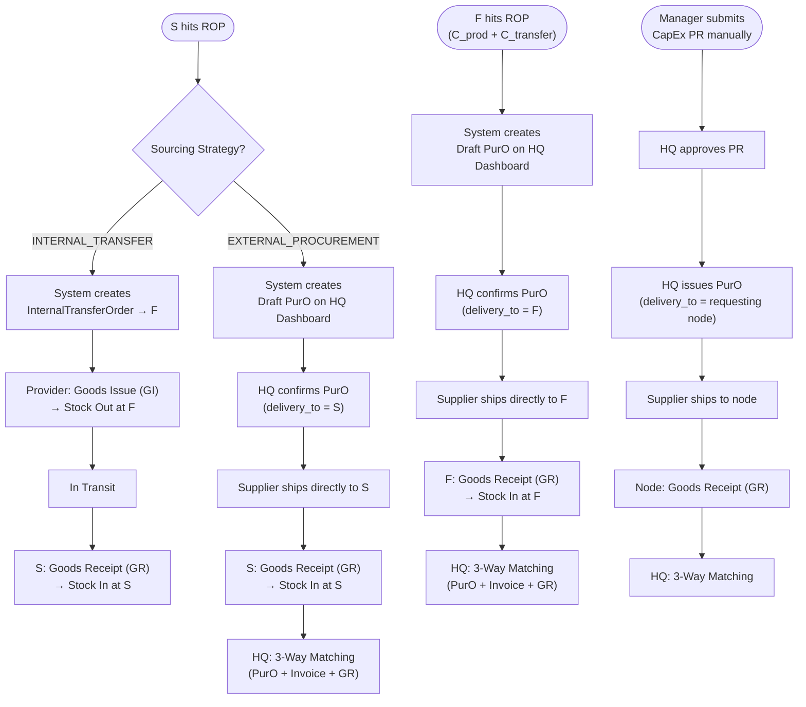

# OneSystem Supply Chain & Inventory
**Version:** 2.0
**Status:** DRAFT

This document details the supply chain workflows, procurement types, and inventory management mechanics for the OneSystem platform. 

---

## Replenishment Flow Overview

All routine replenishment is **ROP-driven and system-automated**. The flow that fires depends on the **Sourcing Strategy** configured per item per node. Manual intervention is only required at the HQ confirmation step for external orders.



### Store (S) — Replenishment Paths

| Path | Strategy | Trigger | End-to-End Flow | Key Documents |
|---|---|---|---|---|
| **A — Internal** | `INTERNAL_TRANSFER` | `NodeStock.qty_on_hand` < ROP | S → F/S_other → *transit* → S | `InternalTransferOrder` (§1.1) |
| **B — External** | `EXTERNAL_PROCUREMENT` | `NodeStock.qty_on_hand` < ROP | S → *Draft PurO* → HQ → Supplier → S | `HQ.PurO` (§1.3) |

### Factory (F) — Replenishment Path

F sits at the top of the internal supply chain; it has no internal provider above it. All F replenishment goes external via HQ.

| Path | Trigger | ROP Formula | End-to-End Flow | Key Documents |
|---|---|---|---|---|
| **External (Auto-Draft)** | F stock < ROP | `(C_prod + C_transfer) × LT + SS` | F → *Draft PurO* → HQ → Supplier → F | `HQ.PurO` (§1.3) |

> `C_transfer` ensures F's ROP accounts for stock consumed by outbound `InternalTransferOrders` to Stores, in addition to internal production (BOM) consumption.

### CapEx / Exceptional Purchases (Any Node)

Always manual. Manager submits `PR` → HQ approves → HQ issues `PurO` → Supplier ships to requesting node → Node creates GR → HQ 3-Way Matching. See §1.2 & §1.3.

---

## 1. Procurement & Logistics Entities

The system strictly divides supply chain operations into three distinct flows based on the source of goods and the nature of the expense (OpEx vs CapEx).

### 1.1 Internal Transfer Order (Auto-Replenishment / S.RO / F.SO)
*Goal: Managing recurring internal stock replenishment (OpEx) between system nodes without external procurement.*

- **Trigger**: 
  - *Primary (Automatic)*: System generates an `InternalTransferOrder` when a Store's item stock drops below its Reorder Point (ROP).
  - *Secondary (Manual)*: Store Manager manually creates an order anticipating high demand (e.g., events, holidays) or to correct unexpected stock loss.
- **Approval**: `AUTO_APPROVED` by default for system triggers. Manual requests can be configured to auto-approve, or route to `PENDING_APPROVAL` (reviewed by Factory Manager/Area Manager) to prevent stock hoarding.
- **Participants**: Store (Requester) ↔ Factory/Other Store (Provider).
- **Logistics Flow (Cross-Site)**:
  1. **Goods Issue (GI)**: Provider (e.g., Factory) packs items, creates a GI capturing driver info, photo/video evidence, and shipping fee. **Triggers Stock Out.**
  2. **In Transit**: Goods move to the requester.
  3. **Goods Receipt (GR)**: Requester (Store) receives items. If there is a quantity mismatch (transit damage), the Store only checks in the usable quantity. **Triggers Stock In.**
  4. **Discrepancy Handling**: Any missing/damaged quantity automatically generates a `DiscrepancyTicket` sent to HQ for accounting and logistics resolution.
- **Logistics Flow (Same-Site / In-Site Transfer)**:
  - *Condition*: When `Requester.site_id == Provider.site_id` (e.g., a Factory and Store operating in the same building).
  - *1-Click Transfer*: Provider uses a simplified "Move to Store" action.
  - *Auto GI & GR*: System generates a simplified GI (no driver, no media proof, zero shipping fee) and immediately triggers and confirms a GR at the destination node.
  - *Result*: Instant **Stock Out** at Provider and **Stock In** at Requester, bypassing the `IN_TRANSIT` phase entirely for a seamless UX.

### 1.2 Purchase Requisition (PR)
*Goal: Formal request submitted by Store/Factory to HQ for CapEx assets (equipment, tools) or exceptional one-off purchases that fall outside routine replenishment.*

- **Trigger**: ALWAYS manual (by Store Manager or Factory Manager).
- **Approval**: Requires HQ approval.
- **Participants**: Store/Factory (Requester) ➔ HQ (Approver).
- **Scope**: CapEx items only — long-term assets that undergo depreciation (e.g., grills, POS systems, furniture). Routine OpEx replenishment (consumables, raw materials) is handled automatically by the ROP system and **does not require a PR**.
- **Rules**:
  - A PR is just a request; it does not directly trigger a supplier shipment or a stock change.
  - If approved, HQ translates the PR into an external Purchase Order (`HQ.PurO`), with `delivery_to` set to the requesting node's address (Store or Factory). **Goods never transit through HQ.**

### 1.3 Purchase Order (HQ.PurO)
*Goal: External procurement from third-party suppliers. Always issued by HQ; goods are delivered directly to the designated destination node (Factory or Store) — HQ holds no physical inventory.*

- **Trigger** — Two distinct paths:
  1. **PR-Triggered (Pull)**: A Store or Factory submits an approved `PR` to HQ for CapEx or exceptional purchases. HQ reviews and converts it into a `PurO`, with `delivery_to` = the requesting node.
  2. **Auto-Draft (System Push)**: When any node (Factory **or** Store) with `sourcing_strategy = EXTERNAL_PROCUREMENT` hits its ROP, the system automatically generates a **Draft PurO** on the HQ Dashboard. HQ reviews and confirms it. The `delivery_to` is the triggering node (Factory or Store).
- **Authority**: ONLY HQ can issue a `PurO`. Stores and Factories **never** contact or buy directly from suppliers.
- **Logistics Flow**:
  1. HQ issues `PurO` to Supplier, specifying `delivery_to` = destination node (Factory or Store).
  2. Supplier delivers goods **directly to the destination node** (no transit through HQ).
  3. Destination node creates a `Goods Receipt (GR)` linked directly to the `PurO`.
  4. **3-Way Matching**: HQ validates `PurO` + `Supplier Invoice` + `Goods Receipt` before authorizing supplier payment.

### 1.4 B2B Sales Order (Wholesale Fulfillment)
*Goal: Fulfilling large wholesale orders to external customers directly from the Factory.*

- **Trigger**: HQ Sales Team creates a B2B Sales Order based on an external client's request.
- **Authority**: HQ negotiates the sale. Factory only executes the fulfillment.
- **Participants**: HQ (Seller) ➔ Factory (Fulfiller) ➔ External Wholesale Customer (Receiver).
- **Logistics Flow**:
  1. HQ assigns the approved B2B Sales Order to a Factory.
  2. **Goods Issue (GI)**: Factory packs items, creates a GI capturing driver info and media proof. **Triggers Stock Out.**
  3. **In Transit**: Goods move to the external customer.
  4. **Completion**: Since the customer is external, there is NO system `Goods Receipt (GR)`. The order is marked `COMPLETED` upon Proof of Delivery from the logistics provider.
  5. **Accounting**: HQ recognizes Revenue and uses the Factory's GI value as Cost of Goods Sold (COGS).

## 2. Inventory & Stock Management

### 2.1 Reorder Point (ROP) & Safety Stock

- Each OpEx item at each node has a configurable **Reorder Point (ROP)**.

#### Standard ROP Formula

```
ROP = (Daily Consumption × Supplier Lead Time) + Safety Stock
```

#### Factory Dual-Consumption ROP Formula

A Factory item may be consumed by **two independent streams simultaneously**:
- **Production consumption** (`C_prod`): raw material used by BOM in manufacturing runs.
- **Transfer consumption** (`C_transfer`): finished/semi-finished goods issued outbound via `InternalTransferOrders` to Stores.

For such items, the standard formula understates true demand. The correct formula is:

```
ROP_factory = ((C_prod + C_transfer) × Supplier Lead Time) + Safety Stock

Where:
  C_prod     = average daily consumption by BOM production (Base Units / day)
  C_transfer = average daily outbound to Stores via InternalTransferOrder (Base Units / day)
  LT         = supplier lead time to Factory (days)
  SS         = safety stock buffer (Base Units)
```

> **Configuration**: Both `C_prod` and `C_transfer` are tracked by the system from historical data and are configurable per item at the Factory node level. The system uses a rolling average window (default: 30 days) for both values.

#### Sourcing Strategy (per item, per node)

Every item at every node is assigned a **Sourcing Strategy** that determines which replenishment document is auto-generated when stock hits the ROP.

| Strategy | Configured For | System Action upon ROP | Resulting Document |
|---|---|---|---|
| `INTERNAL_TRANSFER` | Store or Factory items with a designated internal provider (another Factory or Store) | System auto-creates an `InternalTransferOrder` to the configured provider node | `InternalTransferOrder` (§1.1) |
| `EXTERNAL_PROCUREMENT` | Factory raw materials; Store items with no internal provider | System auto-generates a **Draft PurO** on the HQ Dashboard with `delivery_to` = triggering node | `HQ.PurO` (§1.3 — Auto-Draft path) |

> **Key rule**: Routine OpEx replenishment **always bypasses PR**, regardless of node type. `PR` (§1.2) is reserved exclusively for manual CapEx requests. When a Store or Factory hits ROP under `EXTERNAL_PROCUREMENT`, the system goes directly to a Draft PurO on HQ's dashboard — no PR step required.

> **Note on system flexibility**: Because sourcing strategy is configured per item per node, different deployments can model different supply chains. A Store in one region may replenish an item via `INTERNAL_TRANSFER` from its Factory, while a Store in another region — with no nearby Factory — triggers an `EXTERNAL_PROCUREMENT` Auto-Draft PurO directly to HQ.

### 2.2 Unit of Measure (UoM) & Conversion

**Solution: Base Unit + Packaging Unit model with automatic conversion.**

Each item is defined with:
- A **Base Unit (BU)** — the smallest consumable unit. All internal stock levels, BOM quantities, and kitchen consumption are tracked in base units.
- One or more **Packaging Units (PU)** — the unit used for ordering, receiving, and dispatching between nodes. Each PU has a defined conversion ratio to the base unit.

| Item | Base Unit | Packaging Unit | Conversion |
|---|---|---|---|
| Burger bun | piece | bag | 1 bag = 10 pieces |
| Soft drink can | can | case | 1 case = 24 cans (4 blocks × 6) |
| Cooking oil | ml | bottle | 1 bottle = 1,000 ml |

**Rules:**
- **HQ.PurO to Supplier** — ordered in Packaging Units.
- **Goods Receipt (GR)** — received in Packaging Units; system converts to Base Units for stock.
- **Goods Issue (GI)** — dispatched in Packaging Units; system converts to Base Units on destination receipt.
- **BOM & kitchen consumption** — always in Base Units.
- **Minimum stock threshold / ROP** — configured and displayed in Base Units for precision.

This means staff always work in familiar packaging quantities when ordering/receiving, while the system maintains accurate base-unit stock counts internally.

### 2.3 Price Variance & Cost Allocation

- **OpEx Costing**: The value of goods received via internal transfer (Transfer Price) plus the shipping fee is immediately allocated to the Store's operational expenses (OpEx) for that period.
- **CapEx Costing**: Equipment bought via PR → PurO → GR is **not** expensed immediately. After HQ settles payment (3-Way Matching), the system auto-creates an **Asset record** linking back to the original PR, PurO, and GR. The asset is then manually registered as a **Machine** in the production system by the node manager, at which point it becomes available for production scheduling. The asset's value is expensed gradually through depreciation over its useful life.

---

### 2.4 Inventory Ledger (NodeStock)

OneSystem maintains a live **`NodeStock`** record for every (item, node) pair. This is the **single source of truth for current quantity on hand** — it is what the ROP engine reads, and what the production system checks before starting a Production Order.

| Stock Event | Effect |
|---|---|
| Goods Receipt confirmed (from PurO or ITO) | **➕ Stock In** — `qty_on_hand` increases by received quantity |
| Goods Issue confirmed (ITO dispatch or B2B shipment) | **➖ Stock Out** — `qty_on_hand` decreases by dispatched quantity |
| Production batch completed (raw material consumed) | **➖ Stock Out** — `qty_on_hand` decreases by quantity consumed |

> **ROP Check:** After every stock-decreasing event, the system automatically compares `NodeStock.qty_on_hand` against `NodeItemConfig.reorder_point`. If the threshold is breached, the appropriate replenishment document is created (see §2.1).

> **Production Gate:** Before a Production Order transitions from `PENDING` to `IN_PROGRESS`, the system checks `NodeStock.qty_on_hand` for every raw material ingredient. If any ingredient is insufficient, the order is held as `PENDING` and the Factory Manager is notified. The order auto-resumes once replenishment delivers enough stock.

---

## 3. Open Issues & Decisions Required

| # | Question | Status | Owner |
|---|---|---|---|
| 1 | What is the exact workflow for resolving a `DiscrepancyTicket` with third-party logistics providers (e.g., Lalamove/Ahamove)? | ⏳ Open | Business Owner |
